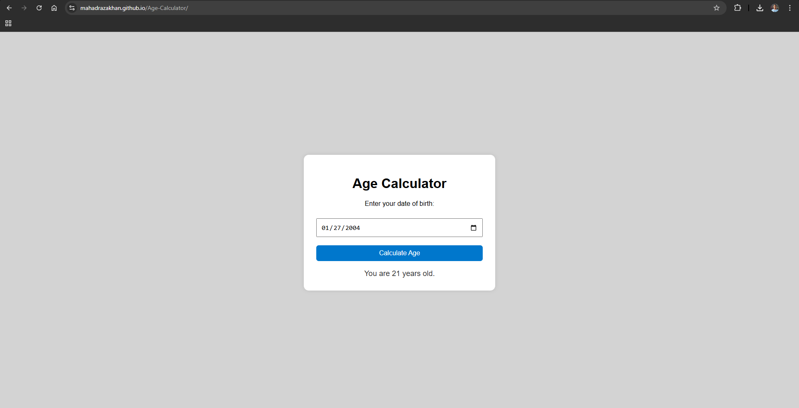

# 🧮 Age Calculator Web App

A simple and responsive Age Calculator web application built using **HTML, CSS, and JavaScript**. Users can select their date of birth, and the app will calculate and display their exact age in years, months, and days.

 <!-- Replace with actual path if needed -->

---

## Features

- Clean and modern design
- Fully responsive on all screen sizes (mobile, tablet, desktop)
- Real-time age calculation based on date of birth
- Easy to use with a single click

---

## 🛠️ Tech Stack

- HTML5
- CSS3 (with media queries for responsiveness)
- JavaScript (vanilla JS)
